<div align="center">


<br>

<a href="https://github.com/arditbe"></a>


<br><br>


</div>

```swift
struct Ardit {
    let born       = 2006
    let started    = "age 10 — BAT files and a stubborn attempt to break into my own Windows"
    let trained    = ["20M", "12B", "32B"]          // parameters, from scratch
    let nextTarget = "1T"                            // the goal, not a claim
    let degree: String? = nil                        // pre-trained myself
    let runsOn     = ["phones", "low-end PCs", "plain CPUs"]
    let lab        = "Grow Labs"
}
```

> I build AI. Twenty years old, researching since 2022, and now starting my own AI lab.

<div align="center">


<br><br>



<br><br>



</div>

*I was ten when I started learning how computers actually work. It is still the best thing I have ever done. Nobody taught me any of it — no course, no bootcamp, no degree. Same curiosity. The machines just got bigger.*

<div align="center">

<br>




<br><br>



<br><br>



<br><br>


 
 <a href="https://github.com/arditbe/auditor"></a>
<a href="https://github.com/arditbe/marie"></a> <a href="https://github.com/arditbe/foryou-ai-engine"></a>
<a href="https://github.com/arditbe/ReShoot"></a> <a href="https://github.com/arditbe/antinude"></a>
<a href="https://github.com/arditbe/scrape-the-internet"></a> 

<br><br>


</div>

| # | Paper | Grow Labs · 2026 |
|:-:|---|---|
| 01 | **How to Build an AI From Scratch** — the whole build, every line of code, runs on a laptop | `guide` |
| 02 | **How to Make AI** — my first model: 20M params, 10k samples, every setting that broke it | `training` |
| 03 | **From Narrow to General** — why scale alone won't reach AGI, and 5 experiments on self-learning | `AGI` |
| 04 | **Fine-Tuning Makes Specialists** — why fine-tuned models drift toward narrow AI | `fine-tuning` |
| 05 | **Auditor** — autonomous continuous evaluation of fine-tuned models | `evaluation` |
| 06 | **Do AI Benchmarks Matter?** — Goodhart's law, contamination, and the two-point lead | `benchmarks` |
| 07 | **How AI Works, and Can It Take Over the World?** — the real danger is loss of control | `safety` |
| 08 | **How AI and AGI Can Change the World for Good** — real, large, and not automatic | `impact` |
| 09 | **Claude and ChatGPT: Two Paths in AI** — trust, measurement and control over "smartest" | `analysis` |

<sub>All of them report what failed as carefully as what worked.</sub>

<div align="center">

<br>



<br><br>



<br><br>


<br><br>

<a href="https://github.com/arditbe"></a>
<a href="https://www.linkedin.com/"></a>
<a href="https://www.instagram.com/"></a>

Open to research collaboration, compute partnerships, and anything that has to survive contact with real people's devices.

<br>


</div>
